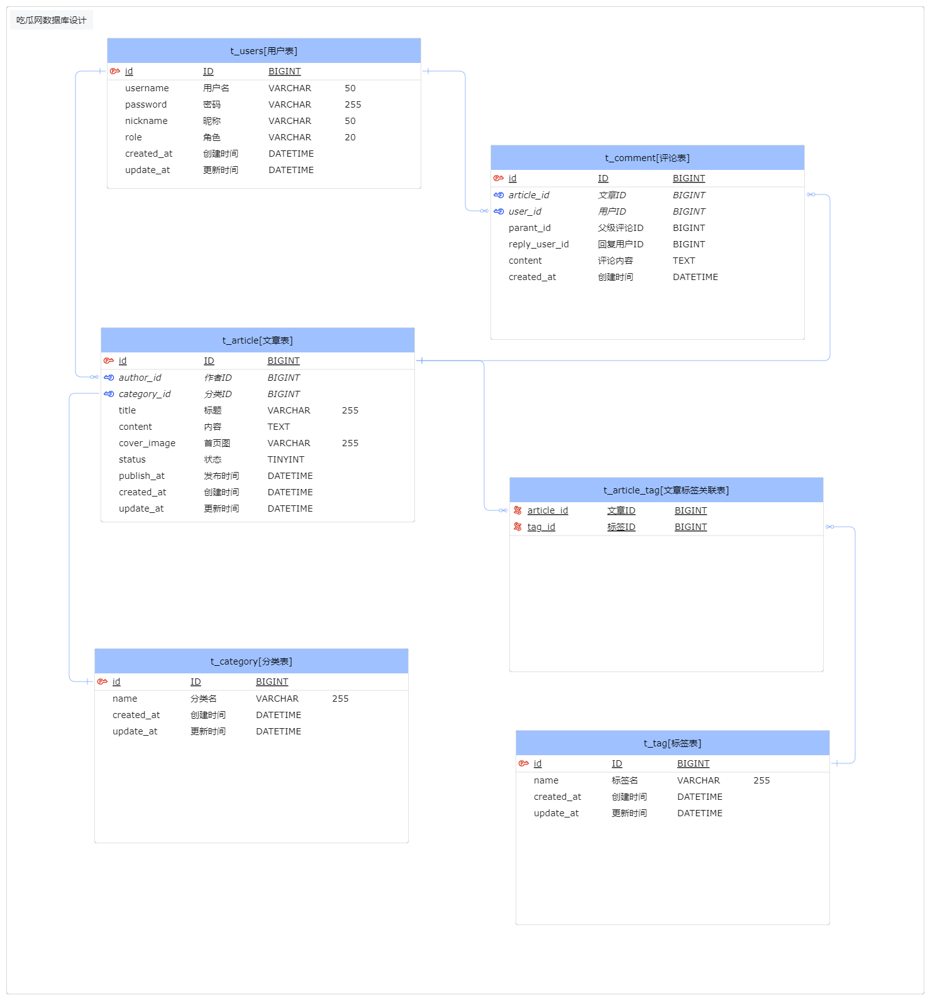

# ChiGua

吃瓜网开源项目

 

## 项目技术栈

1. 前端
    - vue3
    - pinia
    - tailwindcss
    - dayjs
    - @vueuse
    - vite
    - eslint
    - prettier
2. 后端
    - golang
    - gin
    - viper
3. 项目开发工具
    - docker
    - vscode

 

## 项目预览

 

## 数据库设计

