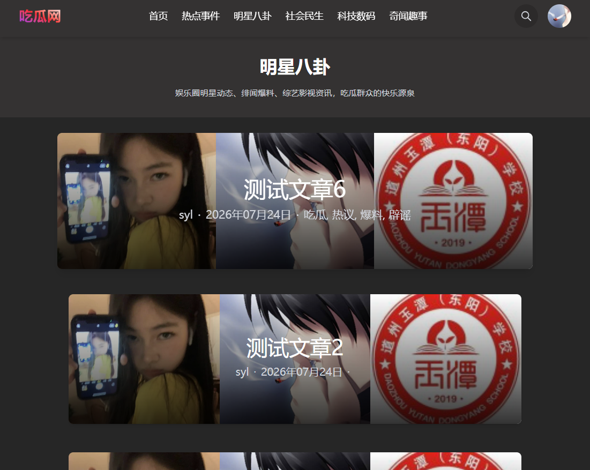
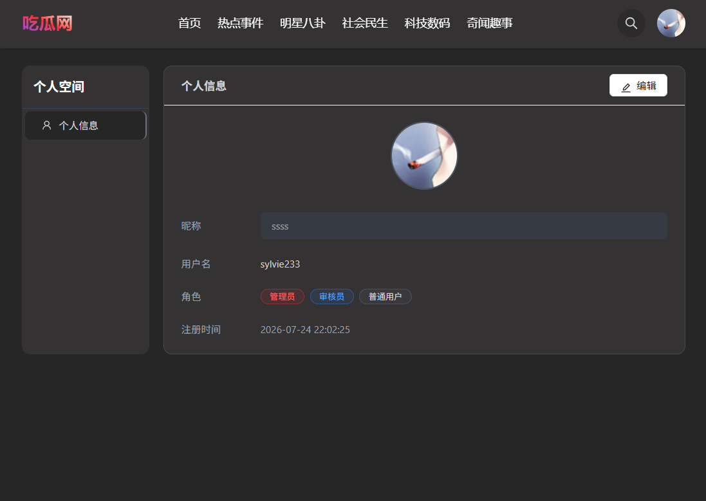
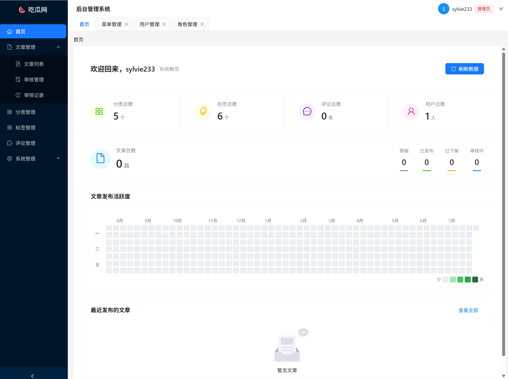
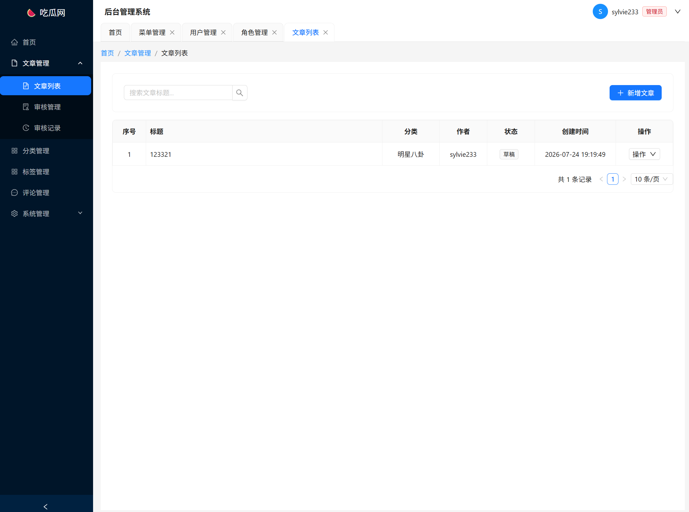
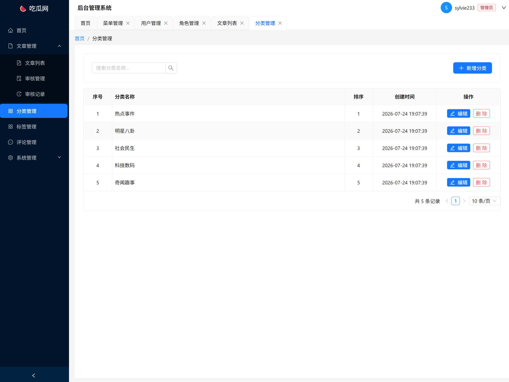
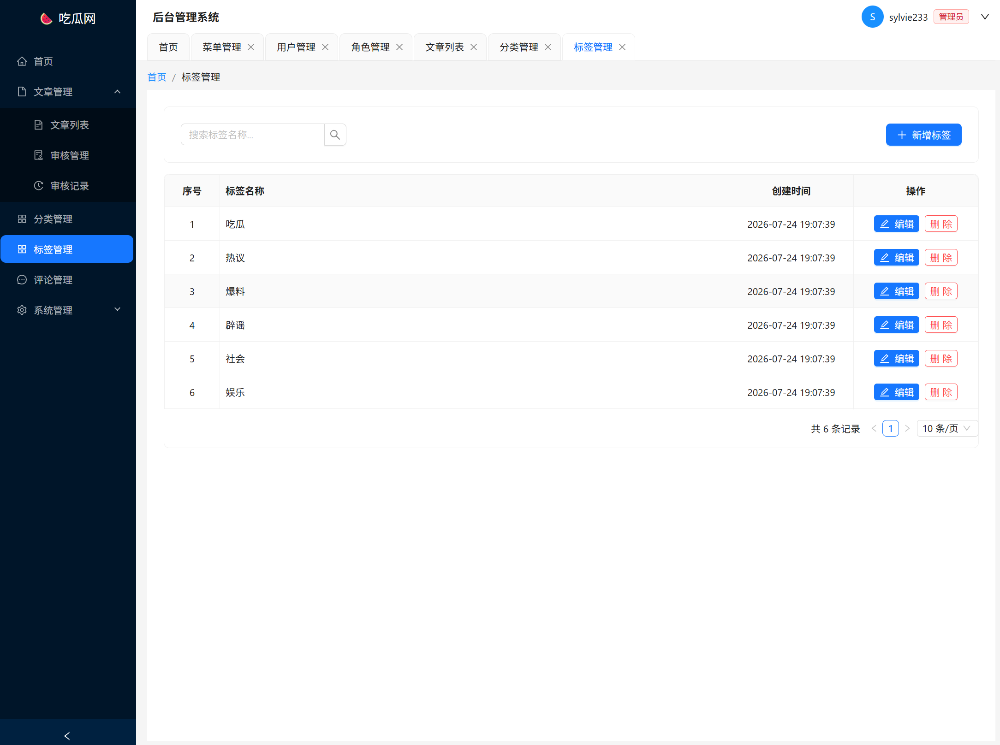

# ChiGua（吃瓜网）

一个基于 Vue3 + Go 的现代化新闻资讯平台，支持文章发布、分类管理、标签系统、评论互动、文件上传、审核流程、RBAC 权限管理及后台数据统计等功能。

## 项目简介

ChiGua 采用前后端分离架构，包含三个子项目：

| 项目 | 说明 | 技术栈 |
|------|------|--------|
| `chigua-backend` | 后端 API 服务 | Go + Gin + PostgreSQL + MinIO |
| `chigua-frontend` | 用户端前端 | Vue 3 + Ant Design Vue + TailwindCSS |
| `chigua-admin` | 管理后台 | Vue 3 + Ant Design Vue + ECharts |

## 项目预览

<div align="center">

### 用户端

| 首页 | 文章详情 |
|:---:|:---:|
|  |  |
|  | |

### 管理后台

| 首页 | 文章管理 |
|:---:|:---:|
|  |  |

| 分类管理 | 评论管理 |
|:---:|:---:|
|  |  |

</div>

## 技术栈

### 前端（chigua-frontend）
- **框架**: Vue 3.5 + TypeScript 6.0
- **UI 组件库**: Ant Design Vue 4.2
- **样式**: TailwindCSS 4.2
- **路由**: Vue Router 5.0
- **状态管理**: Pinia 3.0（持久化插件）
- **HTTP 客户端**: Axios
- **Markdown 渲染**: marked 18
- **工具库**: @vueuse/core、dayjs、lodash-es、nprogress
- **构建工具**: Vite 8.0
- **包管理器**: pnpm
- **代码规范**: ESLint 10 + Prettier

### 管理后台（chigua-admin）
- **框架**: Vue 3.5 + TypeScript
- **UI 组件库**: Ant Design Vue 4.2
- **图表**: ECharts 6 + vue-echarts
- **Markdown 编辑器**: md-editor-v3
- **路由**: Vue Router 4.5（动态路由 + 权限守卫）
- **状态管理**: Pinia 4.0
- **HTTP 客户端**: Axios
- **构建工具**: Vite 8.0

### 后端（chigua-backend）
- **语言**: Go 1.25
- **框架**: Gin Web Framework
- **配置**: Viper
- **数据库**: PostgreSQL（sqlx + lib/pq）
- **对象存储**: MinIO
- **认证**: JWT（golang-jwt/jwt/v5）— 携带权限信息
- **权限**: RBAC（用户 → 角色 → 权限菜单）
- **日志**: logrus
- **IP 定位**: ip2region
- **跨域**: gin-contrib/cors

## 项目结构

```
ChiGua/
├── chigua-backend/          # 后端服务（Go + Gin）
│   ├── cmd/server/          # 服务入口
│   ├── config/              # 配置文件
│   ├── database/            # 数据库连接与初始化
│   ├── internal/
│   │   ├── admin/           # 管理后台 API
│   │   ├── api/             # 用户端 API 控制器
│   │   ├── middleware/      # 中间件（Auth、权限、日志）
│   │   ├── model/           # 数据模型
│   │   ├── router/          # 路由配置（权限中间件）
│   │   ├── service/         # 业务逻辑层
│   │   └── sql/             # SQL 常量
│   └── utils/               # 工具函数（JWT 等）
├── chigua-frontend/         # 用户端前端
│   └── src/
│       ├── components/      # 公共组件
│       ├── router/          # 路由配置
│       ├── services/        # API 请求层
│       ├── stores/          # Pinia 状态管理
│       ├── types/           # TypeScript 类型定义
│       ├── utils/           # 工具函数
│       └── views/           # 页面视图
├── chigua-admin/            # 管理后台
│   └── src/
│       ├── api/             # API 请求层
│       ├── components/      # 公共组件（头像裁剪等）
│       ├── directives/      # 自定义指令（v-permission）
│       ├── layout/          # 布局组件（动态菜单）
│       ├── router/          # 路由配置（权限守卫）
│       ├── stores/          # Pinia 状态管理
│       ├── types/           # TypeScript 类型定义
│       ├── utils/           # 工具函数
│       └── views/           # 管理页面
├── script/                  # 部署脚本与配置
│   ├── docker-compose.yml   # Docker Compose 编排
│   └── init/                # 数据库初始化脚本（含种子数据）
├── doc/                     # 文档与设计资源
│   ├── chigua-api.http      # API 测试文件
│   ├── chigua.pdma          # 数据库设计模型
│   ├── 吃瓜网数据库设计.jpg
│   └── 吃瓜网首页预览图.png
└── README.md
```

## 功能特性

### 用户端
- ✅ 文章浏览（分页列表、详情、分类筛选）
- ✅ 用户注册与登录（JWT 认证）
- ✅ 评论系统（支持二级评论分页加载）
- ✅ 文件上传（MinIO 对象存储）

### 管理后台
- ✅ 文章管理（创建、编辑、删除、发布、下架）
- ✅ 文章审核流程（提交审核 → 审核通过/驳回，支持审核记录）
- ✅ 分类管理（名称判重、排序）
- ✅ 标签管理（名称判重）
- ✅ 评论管理（查看、删除）
- ✅ 用户管理（创建、编辑、头像裁剪上传、角色分配）
- ✅ 角色管理（搜索、分页、CRUD）
- ✅ 菜单管理（动态路由配置、树形表格、CRUD）
- ✅ RBAC 权限控制（用户-角色-菜单，按钮级权限 v-permission 指令）
- ✅ 动态菜单（数据库驱动，按用户权限过滤）
- ✅ 数据统计仪表盘（热力图、统计卡片、最近文章）
- ✅ 个人头像（Canvas 裁剪上传）

## 权限体系

```
用户 ──多对多──▶ 角色 ──多对多──▶ 菜单（权限）

角色预设：
  admin    → 全部权限
  reviewer → 审核 + 查看
  user     → 基础创作

权限类型：
  M（菜单）→ 侧边栏路由
  B（按钮）→ 页面内操作控制（v-permission 指令）

中间件：RequirePermission("article:review")
前端：v-permission="'article:create'"
```

## 快速开始

### 环境要求

- Go 1.25+
- Node.js 18+（推荐 20+）
- pnpm
- PostgreSQL 18+
- Docker & Docker Compose（可选）

### 方式一：Docker Compose 一键启动（推荐）

```bash
cd script
docker compose up -d
```

将同时启动以下服务：

| 服务 | 端口 | 说明 |
|------|------|------|
| PostgreSQL | `5432` | 数据库 |
| MinIO | `9000` / `9001` | 对象存储 / 控制台 |
| Backend | `8080` | 后端 API |
| Frontend | `80` | 用户端前端 |
| Admin | `8081` | 管理后台 |

> MinIO 控制台默认账号：`minioadmin` / 密码：`minio123456`
> 默认管理员账号：`admin` / 密码：`admin123`

### 方式二：本地开发

#### 1. 初始化数据库

```bash
# 执行 SQL 脚本创建表结构和种子数据
psql -U sylvie233 -d chigua -f script/init/chigua.sql
```

#### 2. 启动后端

```bash
cd chigua-backend

# 安装依赖
go mod tidy

# 复制并编辑配置文件
cp config.yaml.example config.yaml

# 启动服务（默认端口 8080）
go run cmd/server/main.go
```

#### 3. 启动用户端前端

```bash
cd chigua-frontend

# 安装依赖
pnpm install

# 启动开发服务器
pnpm dev
```

#### 4. 启动管理后台

```bash
cd chigua-admin

# 安装依赖
pnpm install

# 启动开发服务器
pnpm dev
```

## API 概览

| 模块 | 路径前缀 | 说明 |
|------|----------|------|
| 用户 | `/api/user` | 注册、登录、个人信息、头像更新 |
| 文章 | `/api/article` | 文章 CRUD、审核提交流程 |
| 分类 | `/api/category` | 分类管理（含排序） |
| 标签 | `/api/tag` | 标签管理 |
| 评论 | `/api/comment` | 评论发布、分页加载 |
| 文件 | `/api/upload` | 文件上传（MinIO） |
| 管理后台 | `/api/admin` | 后台管理入口 |
| 文章管理 | `/api/admin/article` | 文章管理（权限控制） |
| 分类/标签/评论 | `/api/admin/category`, `/tag`, `/comment` | 后台管理 |
| 用户管理 | `/api/admin/user` | 用户 CRUD、角色分配 |
| 角色管理 | `/api/admin/role` | 角色 CRUD、菜单权限配置 |
| 菜单管理 | `/api/admin/menu` | 菜单树加载、菜单 CRUD |
| 统计 | `/api/admin/stats` | 仪表盘数据 |

> 详细接口定义参考 [doc/chigua-api.http](doc/chigua-api.http)

## 开发规范

### Git 提交规范

| 前缀 | 说明 |
|------|------|
| `feat` | 新增功能 |
| `fix` | 修复 Bug |
| `docs` | 文档更新 |
| `style` | 代码格式调整 |
| `refactor` | 代码重构 |
| `test` | 测试用例 |
| `chore` | 构建/工具变更 |

### 代码规范

- **前端**：ESLint + Prettier，TypeScript 严格模式
- **后端**：遵循 Go 官方代码规范与项目约定

## 贡献指南

欢迎提交 Issue 和 Pull Request！

## License

[MIT License](LICENSE)
