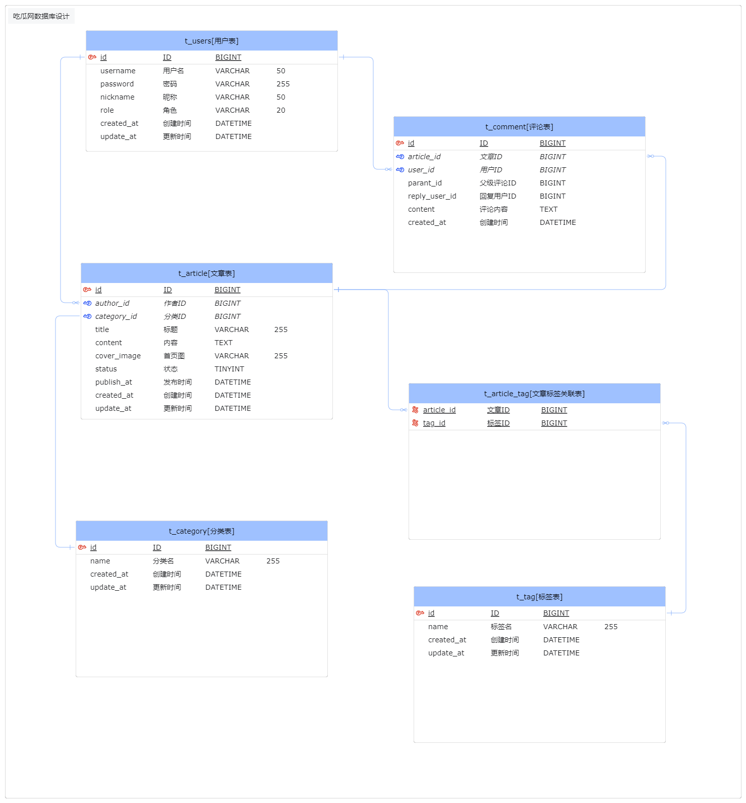

# ChiGua

吃瓜网开源项目 - 一个现代化的新闻资讯平台

## 项目简介

ChiGua 是一个基于 Vue3 + Go 的现代化新闻资讯平台，支持文章发布、分类管理、标签系统、评论功能等。

## 技术栈

### 前端
- **框架**: Vue 3
- **状态管理**: Pinia
- **样式**: TailwindCSS 3
- **日期处理**: Day.js
- **工具库**: @vueuse/core
- **构建工具**: Vite
- **代码规范**: ESLint + Prettier

### 后端
- **语言**: Go 1.22+
- **框架**: Gin Web Framework
- **配置**: Viper
- **数据库**: PostgreSQL 15+
- **ORM**: sqlx
- **认证**: JWT
- **日志**: logrus

### 开发工具
- Docker
- VS Code

## 项目结构

```
ChiGua/
├── chigua-backend/         # 后端服务
│   ├── cmd/               # 命令入口
│   ├── config/            # 配置管理
│   ├── database/          # 数据库连接
│   ├── internal/          # 内部模块
│   │   ├── api/          # API 控制器
│   │   ├── middleware/    # 中间件
│   │   ├── model/         # 数据模型
│   │   ├── router/        # 路由配置
│   │   ├── service/       # 业务逻辑
│   │   └── sql/           # SQL 常量
│   └── utils/             # 工具函数
├── chigua-frontend/       # 前端应用（待创建）
├── doc/                   # 文档资源
├── docker-compose.yml     # Docker Compose 配置
└── README.md             # 项目说明
```

## 功能特性

### 文章管理
- ✅ 文章创建、编辑、删除
- ✅ 文章发布状态管理（草稿/发布/下架）
- ✅ 文章列表分页查询
- ✅ 文章分类和标签关联

### 分类管理
- ✅ 分类创建（名称判重）
- ✅ 分类列表查询
- ✅ 分类删除

### 标签管理
- ✅ 标签创建（名称判重）
- ✅ 标签列表查询
- ✅ 标签删除

### 评论系统
- ✅ 评论创建
- ✅ 评论列表查询
- ✅ 评论删除（仅作者）

### 用户系统
- ✅ 用户注册
- ✅ 用户登录
- ✅ JWT 认证

## 快速开始

### 环境要求

- Go 1.22+
- Node.js 18+
- PostgreSQL 15+
- Docker (可选)

### 后端启动

```bash
# 进入后端目录
cd chigua-backend

# 安装依赖
go mod tidy

# 复制配置文件
cp config.yaml.example config.yaml

# 编辑配置文件（修改数据库连接等）
vim config.yaml

# 启动服务
go run cmd/server/main.go
```

### Docker 部署

```bash
# 使用 Docker Compose 启动
docker-compose up -d
```

## 项目预览


## 数据库设计



## API 文档

后端服务启动后，可访问以下接口：

| 模块 | 路径 | 描述 |
|------|------|------|
| 用户 | `/api/user/register` | 用户注册 |
| 用户 | `/api/user/login` | 用户登录 |
| 文章 | `/api/article` | 文章 CRUD |
| 分类 | `/api/categorie` | 分类 CRUD |
| 标签 | `/api/tag` | 标签 CRUD |
| 评论 | `/api/comment` | 评论 CRUD |

## 开发规范

### 代码规范
- 前端：使用 ESLint + Prettier 进行代码检查
- 后端：遵循 Go 官方代码规范

### Git 规范
- `feat`: 新增功能
- `fix`: 修复 bug
- `docs`: 文档更新
- `style`: 代码格式调整
- `refactor`: 代码重构
- `test`: 测试用例

## 贡献指南

欢迎提交 Issue 和 Pull Request！

## License

MIT License
